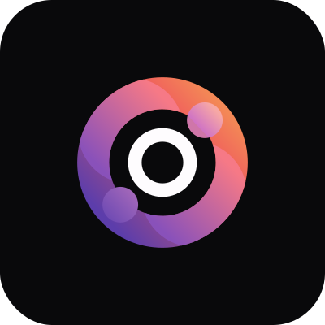

<h1>
    
</h1>

<h1>
    
</h1>

### 🧾 Sobre

<p>Esse projeto foi desenvolvido durante o NLW-POCKET, da <a href="https://www.rocketseat.com.br/" title="Rocketseat" target="_blank">Rocketseat</a>. O projeto é um site desktop de registro de metas com progresso semanal.</p>

---

### 🚀 Tecnologias utilizadas

## Frontend
-   React
-   TypeScript
-   TailwindCss
-   Tailwind-merge
-   Tailwind-variants
-   Radix-ui
-   Dayjs
-   Lucide-react
-   React-hook-form
-   @Hookform/resolvers
-   Zod
-   biomejs


---

### 〽️ Getting started

#### Frontend
```zsh
    # Clonando o repositório em sua máquina
    $ git clone https://github.com/edsonjaguiar/ignite-lab-react

    # Acessando o repositório
    $ cd ignite-lab-react

    # Instalando as dependências
    $ npm i

    # Iniciando o server
    $ npm run dev
```